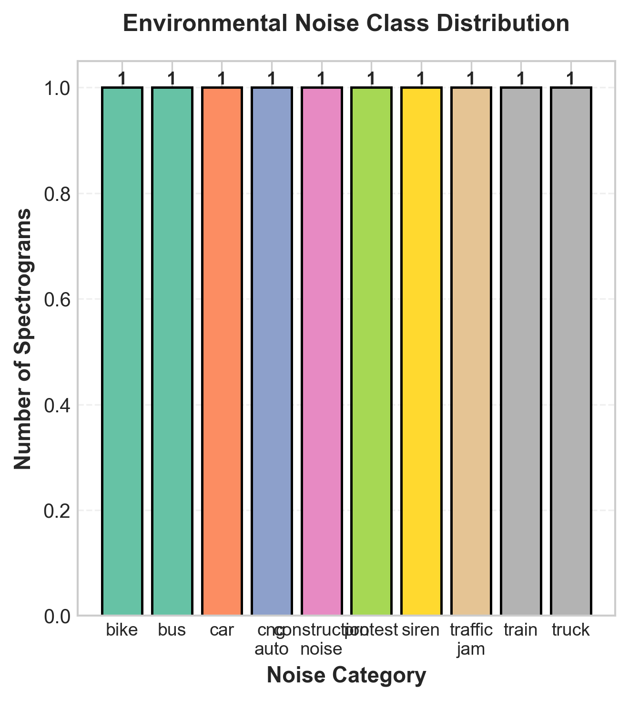
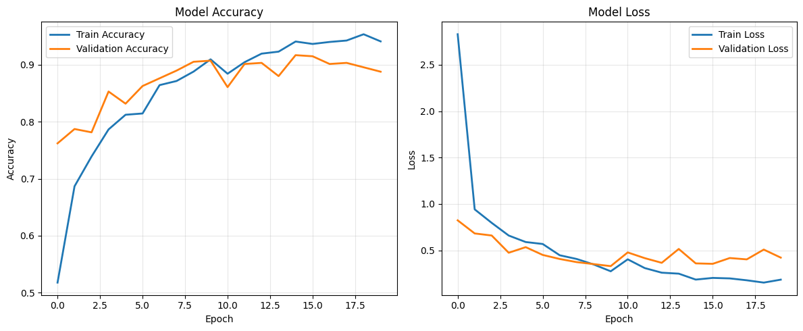
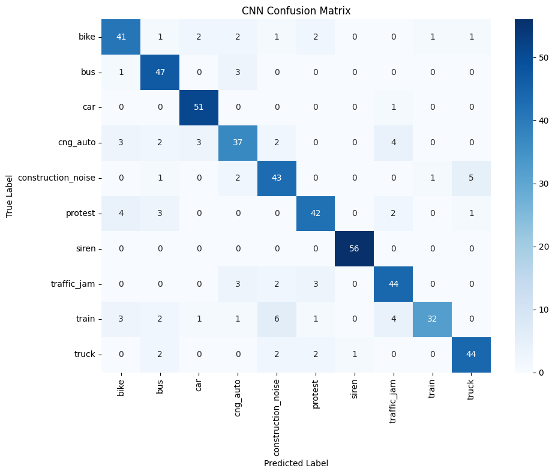
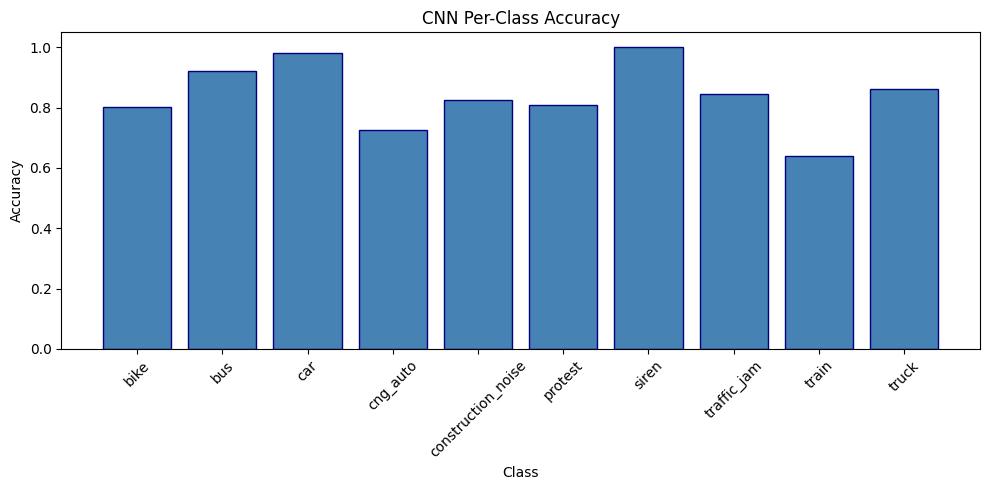

# Bangladeshi Urban Audio ML Dataset & Classifier

[](https://github.com/MehediHasan-75/bangladesh-audio-ml/actions/workflows/ci.yml)
[](https://www.python.org/)
[](LICENSE)

## Executive Summary

- **What:** First-of-its-kind 10-class urban audio dataset for Bangladesh, capturing acoustic scenes unique to Dhaka's soundscape (CNG auto-rickshaws, rickshaws, protest crowds, dense traffic jams)
- **How:** Fully automated pipeline combining YouTube downloads (yt-dlp with retry/dedup) and multi-format physical recordings, producing 48 kHz mono WAV segments with quality filtering
- **Result:** CNN and Wav2Vec2 classifiers trained end-to-end; see [Model Results](#model-results) for accuracy and F1 scores

---

## Demo

```bash
streamlit run app/demo.py
```

`app/demo.py` provides live inference with SHAP explanations — upload any audio clip and get a predicted class with per-feature attribution.

---

## Table of Contents

- [Dataset & Collection Methodology](#dataset--collection-methodology)
- [Pipeline Architecture](#pipeline-architecture)
- [Model Results](#model-results)
- [Tech Stack](#tech-stack)
- [Quick Start](#quick-start)
- [Project Structure](#project-structure)
- [Future Work](#future-work)

---

## Dataset & Collection Methodology

### 10 Sound Categories

| Category | Description |
|---|---|
| `bike` | Motorcycle engine and horn sounds |
| `bus` | City bus engine and traffic noise |
| `car` | Passenger car sounds |
| `cng_auto` | CNG auto-rickshaw engine sounds |
| `construction_noise` | Construction site machinery |
| `protest` | Crowd and protest sounds |
| `siren` | Emergency vehicle sirens |
| `traffic_jam` | Dense urban traffic ambience |
| `train` | Train engine and rail sounds |
| `truck` | Heavy truck engine sounds |

### Class Distribution



### Pipeline Parameters

| Parameter | Value |
|---|---|
| Segment length | 10 s |
| Sample rate | 48 kHz mono |
| Silence rejection | < −45 dBFS |
| Min audio content | ≥ 30% non-silent |
| Output format | WAV (PCM) |

### Two-Source Collection

**YouTube (automated):** URLs tracked in `data/youtube_urls.csv` → downloaded via yt-dlp with exponential-backoff retry and video-ID deduplication → raw audio stored in `ml_data/raw/`.

**Physical recordings:** Audio/video files placed in `ml_data/physically_collected/<category>/` → supports 8 audio formats (`.opus`, `.m4a`, `.mp3`, `.aac`, `.wav`, `.ogg`, `.flac`, `.wma`) and 8+ video formats (FFmpeg extracts audio automatically).

Both sources produce identical output: `<category>_XXXX.wav` segments with smart sequential numbering (never overwrites, never gaps).

---

## Pipeline Architecture

```
data/youtube_urls.csv          ml_data/physically_collected/
        │                                   │
  YouTubeAudioCollector            PhysicalAudioProcessor
  (yt-dlp, retry + dedup)          (8+ audio/video formats)
        │                                   │
        └──────────── AudioProcessor ───────┘
                      (10-s segments, 48 kHz mono)
                               │
                      QualityController
                      (silence + speech % checks)
                               │
                  ml_data/processed/<category>/
                               │
               ┌───────────────┴───────────────┐
           CNN Classifier              Wav2Vec2 Fine-tune
         (MFCC features)            (Hugging Face Transformers)
               │                               │
          MLflow tracking               MLflow tracking
               └───────────────┬───────────────┘
                         Streamlit Demo
                      (live inference + SHAP)
```

---

## Model Results

| Model | Accuracy | Weighted F1 |
|---|---|---|
| CNN (MFCC features) | see chart below | see chart below |
| Wav2Vec2 fine-tune | see chart below | — |

Full per-class metrics are logged via MLflow (`experiments/track_experiment.py`).

### Training Curve



### Confusion Matrix (CNN)



### Per-Class Accuracy (CNN)



---

## Tech Stack

| Category | Tools |
|---|---|
| Audio processing | pydub, librosa, FFmpeg |
| ML / Deep Learning | PyTorch, Hugging Face Transformers |
| MLOps | MLflow, DVC |
| Data pipeline | yt-dlp, pandas, PyYAML |
| Demo | Streamlit, SHAP |
| Testing / CI | pytest, GitHub Actions |

---

## Quick Start

```bash
# 1. Clone and set up
git clone https://github.com/MehediHasan-75/bangladesh-audio-ml.git
cd bangladesh-audio-ml
brew install ffmpeg                          # macOS; see docs for Linux/Windows
python3 -m venv .venv && source .venv/bin/activate
pip install -r mac_requirements.txt          # Linux: requirements.txt

# 2. Collect YouTube audio
python scripts/collect_audio.py

# 3. Process physical recordings
python scripts/process_physical.py

# 4. Run the Streamlit demo
streamlit run app/demo.py
```

Reproduce the full DVC pipeline:

```bash
dvc repro      # collect → process → quality_check
```

---

## Project Structure

```
bangladeshi-audio-ml/
├── app/                    # Streamlit demo with SHAP explanations
├── config/                 # Pipeline parameters (config.yaml)
├── data/                   # YouTube URL lists
├── experiments/            # MLflow experiment scripts
├── ml_data/                # All data (raw → processed → quality_report)
├── notebooks/              # Exploratory analysis & model training
├── scripts/                # CLI entry points (collect, process, convert)
├── selected_outputs/       # Model evaluation charts
├── spectrograms/           # Per-class spectrogram visualizations
├── src/                    # Core library (collectors, processors, quality)
└── tests/                  # pytest unit tests
```

---

## Future Work

- **Data augmentation:** Apply SpecAugment, pitch shifting, and room impulse responses to increase effective dataset size
- **Real-time inference:** Export model to ONNX and wrap with a FastAPI endpoint for sub-100 ms latency
- **More categories:** Expand to rickshaw bells, street vendors, rain/weather, and mosque calls
- **DVC cloud remote:** Switch local DVC storage to S3/GCS for team-scale reproducibility (`dvc remote modify local_storage url s3://your-bucket/path`)
